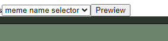
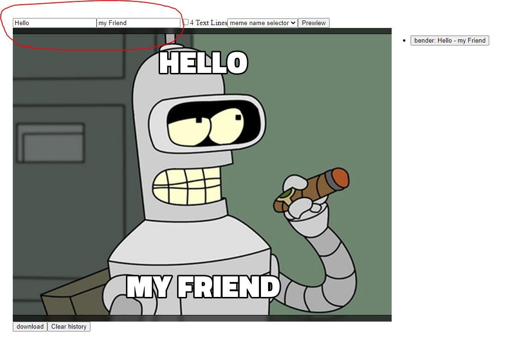
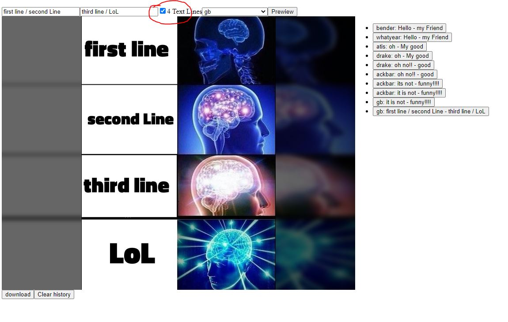
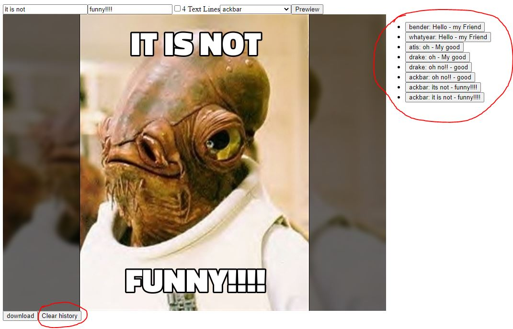
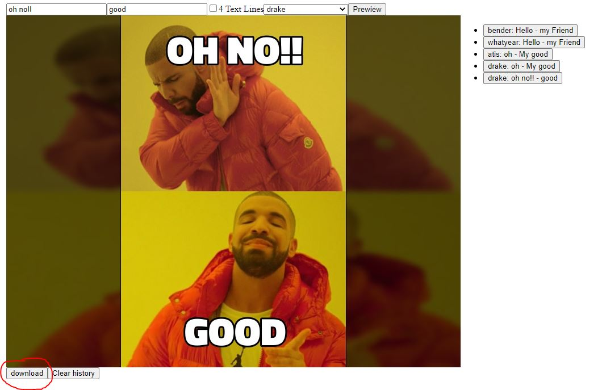

# Meme Generator

[Web version](https://react-meme-scraper.netlify.app/).
[Code sandbox version](https://codesandbox.io/s/github/Josehower/React-meme-generator).

this application allow you to download a custom meme from memegen.link/ API, you can get this image on different versions.

## Usage

- Use the drop down to choose the meme name that you prefer

- Apply the text you want

- If needed, use the check box to apply more lines, just separate the text on boxes whit a /.

- The app remembers your creations, you still can reset it if needed.

- Download the image of your preference and enjoy.

This project was bootstrapped with [Create React App](https://github.com/facebook/create-react-app).

## Available Scripts

In the project directory, you can run:

### `yarn start`

Runs the app in the development mode. 

The page will reload if you make edits. 

### `yarn test`

Launches the test runner in the interactive watch mode. 

### `yarn build`

Builds the app for production to the `build` folder. 
It correctly bundles React in production mode and optimizes the build for the best performance.

### `yarn eject`

**Note: this is a one-way operation. Once you `eject`, you can’t go back!**

If you aren’t satisfied with the build tool and configuration choices, you can `eject` at any time. This command will remove the single build dependency from your project.
